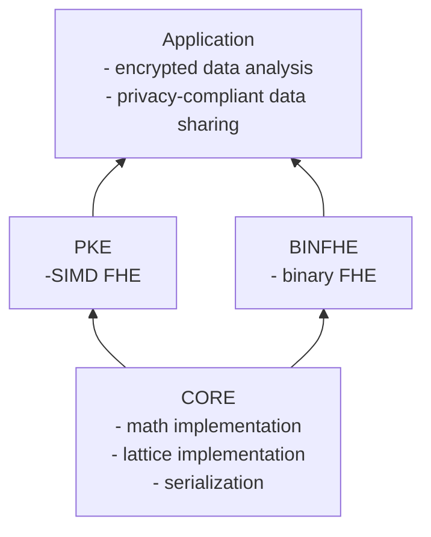

# OpenFHE Code Components

# binFHE

    -[ ] Boolean arithmetic, comparisons, and aribtrary function evaluation based on Ducas-Micciancio (DM) and Chillotti-Gama-Georgieva-Izabachene (CGGI) schemes

# core

- underlying implementation providing the base that `binFHE` and `pke` are built off of

# pke

    -[x] real-number arithmetic based on Cheon-Kim-Kim-Song (CKKS) scheme
    -[ ] integer arithmetic based on Brakerski-Gentry-Vaikuntanathan (BGV) and Brakerski/Fan-Vercauteren (BFV) schemes